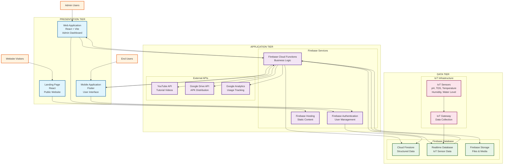

# Cropify Three-Tier System Architecture

## Architecture Overview
This document outlines the three-tier system architecture for the Cropify IoT-powered hydroponics management platform.

## Three-Tier Architecture Diagram

## Tier Breakdown

### 1. Presentation Tier (Client Layer)
- **Web Application**: React-based admin dashboard for system management
- **Mobile Application**: Flutter-based mobile app for end users
- **Landing Page**: Public website for marketing and app downloads

### 2. Application Tier (Business Logic Layer)
- **Firebase Authentication**: User authentication and authorization
- **Firebase Cloud Functions**: Server-side business logic and data processing
- **Firebase Hosting**: Static content delivery and CDN
- **External APIs**: YouTube, Google Drive, and Analytics integrations

### 3. Data Tier (Data Layer)
- **Cloud Firestore**: Structured data storage (user profiles, admin data, news, tutorials)
- **Realtime Database**: Live IoT sensor data streaming
- **Firebase Storage**: File storage for APK files, images, and media
- **IoT Infrastructure**: Physical sensors and data collection gateway

## Data Flow

1. **IoT Sensors** collect real-time data (pH, TDS, temperature, humidity)
2. **IoT Gateway** aggregates and transmits data to **Realtime Database**
3. **Cloud Functions** process sensor data and apply business logic
4. **Web/Mobile Apps** consume processed data through Firebase services
5. **Admin Dashboard** provides management interface for system monitoring
6. **Mobile App** delivers real-time insights to end users

## Security Features

- **Firebase Authentication** with 2FA support
- **Role-based access control** (admin/superadmin)
- **Secure API endpoints** with Firebase App Checkz
- **Data encryption** in transit and at rest
- **Audit logging** for all admin actions

## Scalability Features

- **Serverless architecture** with Firebase Cloud Functions
- **Real-time data synchronization** across all clients
- **CDN distribution** for global content delivery
- **Automatic scaling** based on demand
- **Modular component design** for easy maintenance

